<div align="center">

# ⚡ FengAgentCli

**开源本地 AI Agent 对话平台** — 在终端或浏览器中与 AI 对话，支持工具调用、多 Agent 协作、上下文压缩、对话图溯源与回退重答。

[TypeScript](https://www.typescriptlang.org/) · [Bun](https://bun.sh/) · [Ink TUI](https://github.com/vadimdemedes/ink) · [React](https://react.dev/) · [Hono](https://hono.dev/)


📖 [在线文档](https://zhu011.github.io/FengAgentCli/) · 📦 [Releases](https://github.com/zhu011/FengAgentCli/releases) · 🐛 [Issues](https://github.com/zhu011/FengAgentCli/issues)

</div>

> **分支说明**：本 README 对应 `refactor/cordis-graph-architecture` 分支（Cordis 插件化 + 对话图/可回溯 + 事件溯源架构）。
> `main` 分支为经典 Loop 架构，两分支数据与配置完全隔离（本分支数据根 `.fengagent-cordis/`）。

---

## ✨ 特性

| 图标 | 特性 | 说明 |
|:---:|------|------|
| 💬 | **智能对话** | 多轮上下文对话，SSE 流式输出，Markdown 渲染，代码语法高亮 |
| 🕸️ | **对话图（Graph）** | 每轮「提问→回答」沉淀为节点，可溯源、可分支、可回退 |
| ↩️ | **回退重答** | `/rollback` 回退到任意节点重答，旧分支完整保留 |
| 🧩 | **插件化架构** | 模型 / 工具 / 策略 / 存储 / 上下文 / Loop / 图全部为可插拔服务（Cordis） |
| 📜 | **事件溯源** | 会话以 append-only 事件日志为准，可导出 / 导入 / 重建 / 跨机迁移 |
| 🤖 | **多 Agent** | Task 工具派遣子 Agent，独立会话 + 角色定义 |
| 🔧 | **工具调用** | 文件读写、Bash、Glob/Grep、Web 抓取、记忆、Skill |
| 🧪 | **实验沙箱** | 临时文件 / 临时代码在隔离沙箱执行，安全可控 |
| 🌐 | **WebUI** | React + Vite 三套主题，对话图可视化面板，KV Cache 统计 |
| 🧠 | **记忆系统** | MEMORY.md + 分类记忆 + 向量检索 |
| 📊 | **Agent 测评** | `bun run eval` 自动生成工具成功率 / KV Cache 命中率报告 |

## 🚀 快速开始

**环境要求**：Bun ≥ 1.3.0 + 任一 LLM API Key（Anthropic / OpenAI / OpenAI-Compatible / Google / Bedrock）。

```bash
# 1. 克隆并安装
git clone https://github.com/zhu011/FengAgentCli.git
cd FengAgentCli
bun install

# 2. 配置 API Key（以 DeepSeek 为例）
export FENG_PROVIDER=openai-compatible
export OPENAI_COMPATIBLE_API_KEY=sk-...
export OPENAI_COMPATIBLE_BASE_URL=https://api.deepseek.com

# 3. 启动
bun run packages/cli/src/entry.ts     # 终端 TUI 对话
bun run serve                         # WebUI：访问 http://127.0.0.1:3000
```

> 💡 也可以用 `/provider` 命令在对话中直接配置，无需改环境变量、无需重启。

### 全局安装（一条命令启动 TUI）⭐

> **不想克隆仓库？** 全局安装后**任意目录**直接运行 `fengagent` 即可进入 TUI，无需进入项目目录。

```bash
npm install -g fengagent   # 或 bun install -g fengagent
npm install -g ./fengagent-0.2.0.tgz   # 本地打包安装：先运行 bun run pack 生成 tgz
fengagent                  # 任意目录直接进入 TUI
fengagent acp              # ACP 服务（Multica 运行时）
```

### 一键 Demo

```bash
bash scripts/demo.sh                    # Linux / macOS
powershell -ExecutionPolicy Bypass -File scripts/demo.ps1   # Windows
```

## 📸 界面预览

| TUI 欢迎页 | TUI 对话流（填充气泡） | TUI 超长消息气泡 |
|:---:|:---:|:---:|
| 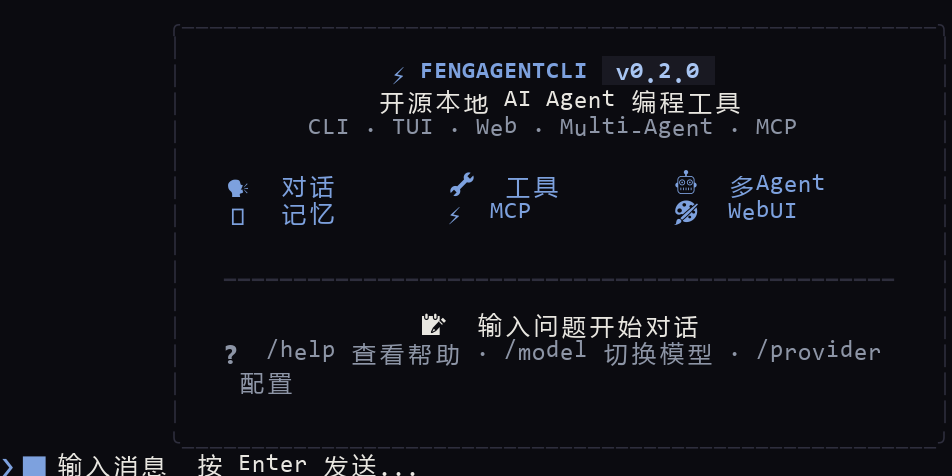 | 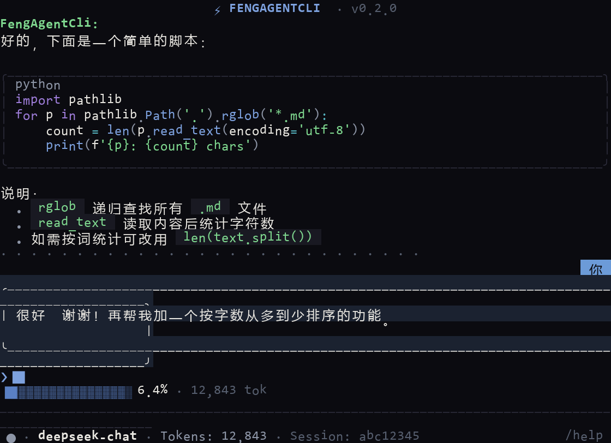 | 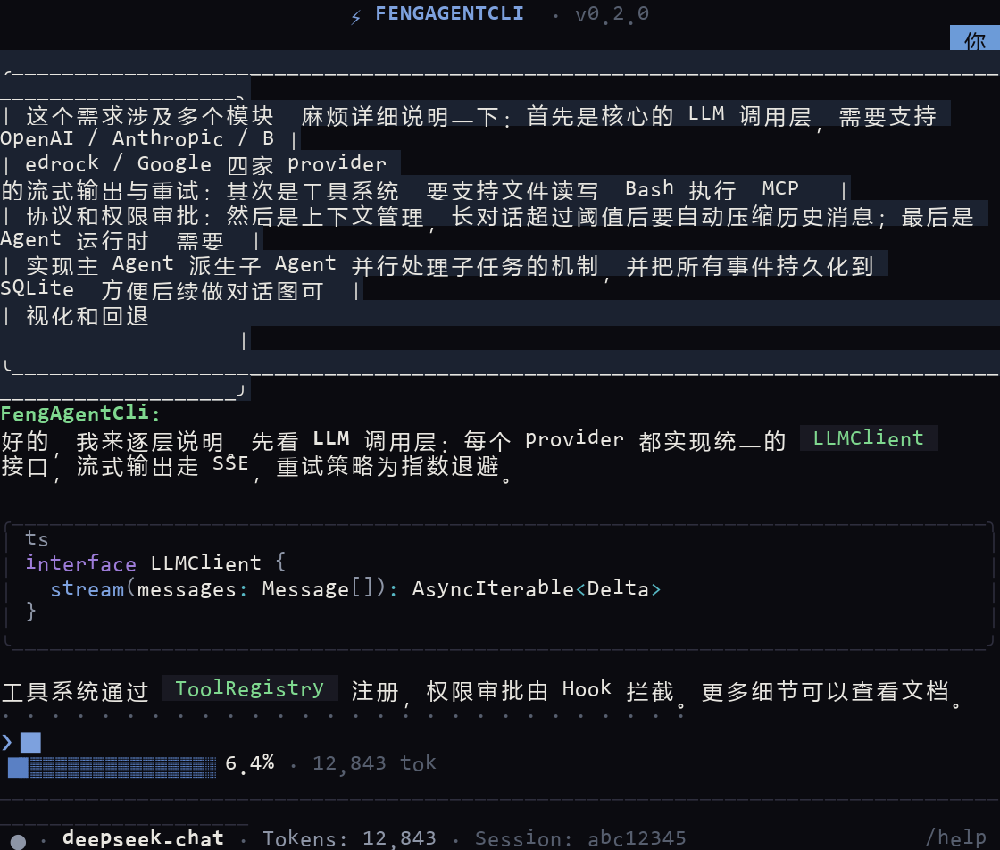 |

| WebUI 欢迎页（深空） | WebUI 对话（深空） | WebUI 对话（日光） |
|:---:|:---:|:---:|
| 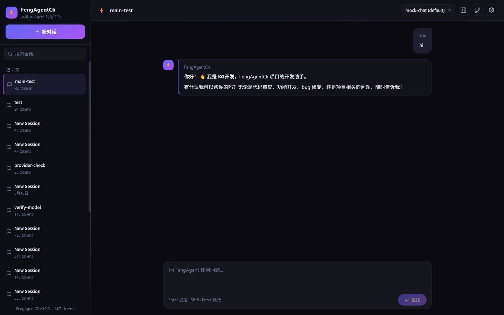 |  | 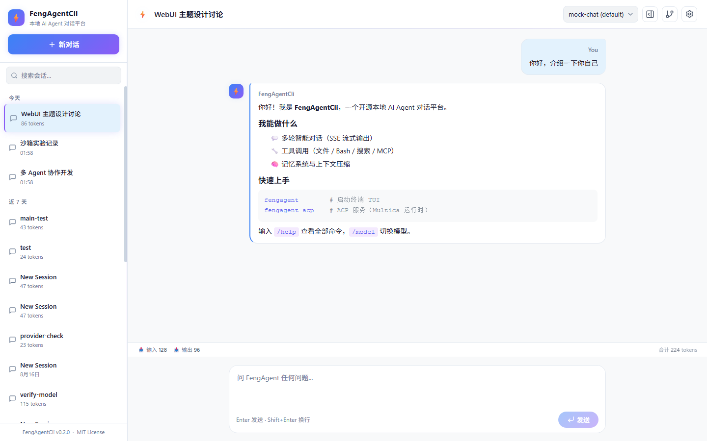 |

| 生成中指示器（计时 + Esc 中断） | 代码块复制按钮 | 侧边栏会话搜索 |
|:---:|:---:|:---:|
| 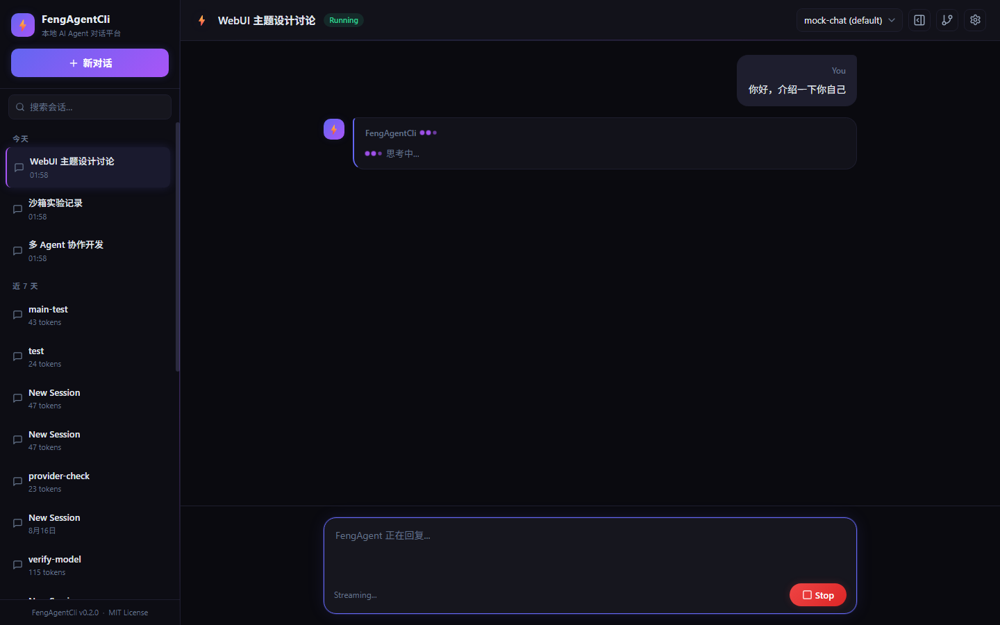 | 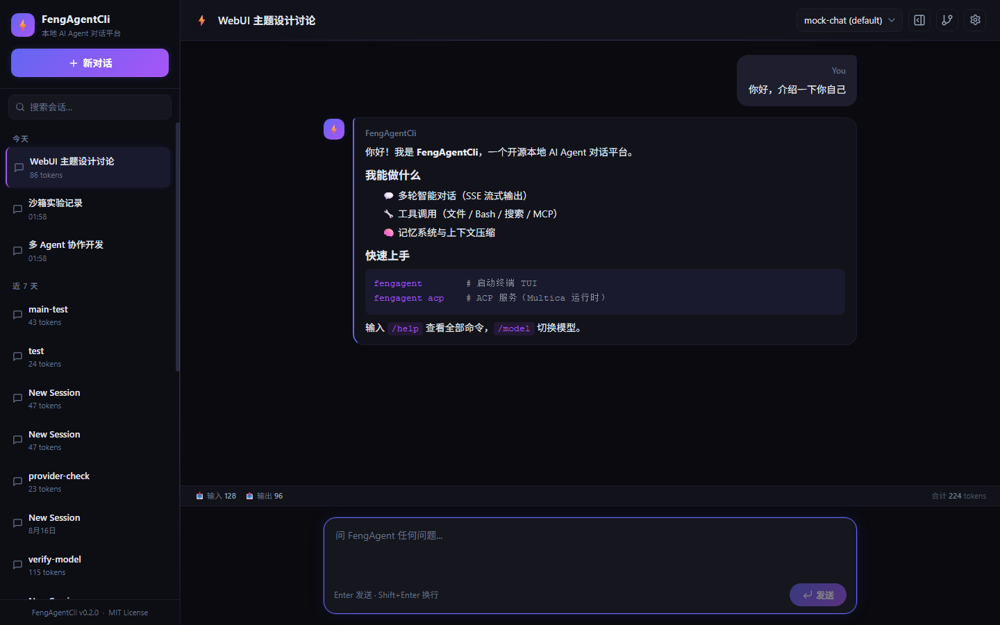 | 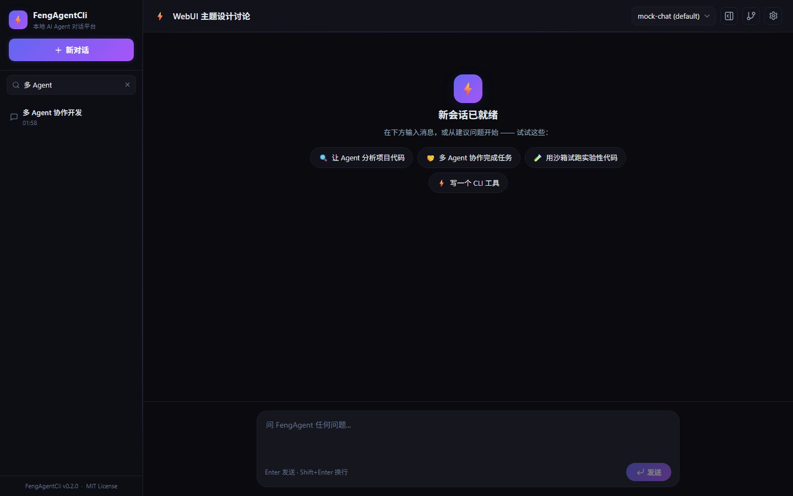 |

| 思考过程流式显示（展开） | 思考面板（折叠） | TUI 思考流式输出 |
|:---:|:---:|:---:|
| 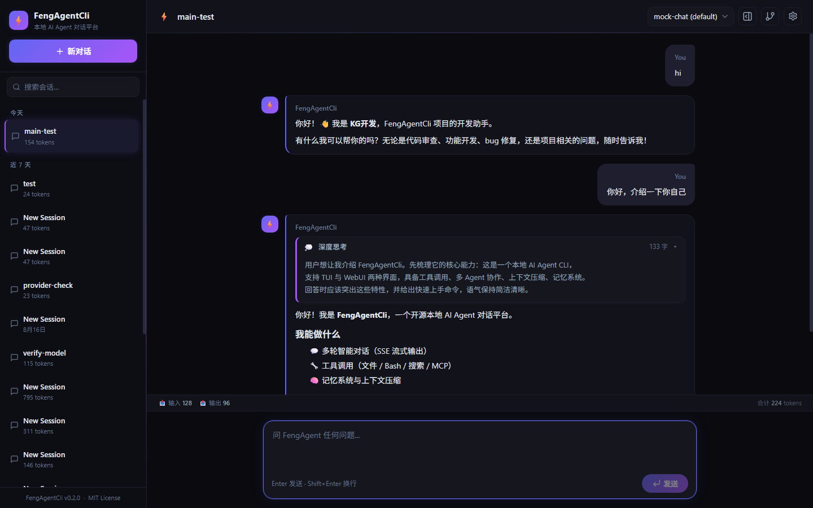 | 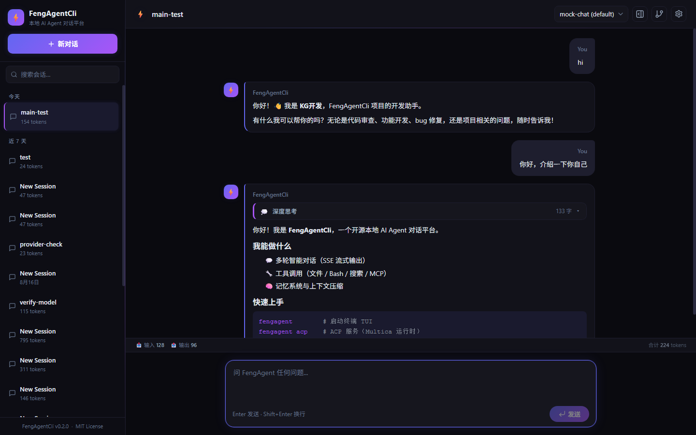 | 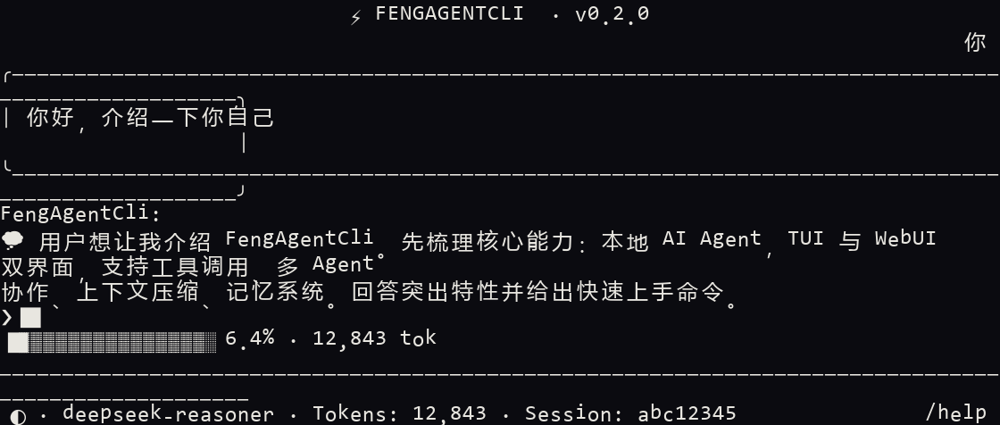 |

## 💻 使用指南

### TUI（终端对话）

- **对话**：直接输入问题，`Enter` 发送；`/` 弹出命令补全
- **常用命令**：`/help` 帮助 · `/model` 切换模型 · `/provider` 配置服务商 · `/graph` 对话图 · `/rollback` 回退重答 · `/compact` 压缩上下文 · `/clear` 清屏
- **长对话**：`PgUp/PgDn` 或鼠标滚轮翻阅历史，`Home` 回顶、`End` 回底
- **思考可视化**：推理模型（DeepSeek reasoner / Anthropic thinking）的思考过程**实时流式显示**（`💭` 缩进斜体），不再只有动画宠物空转
- **状态栏**：上下文占用进度条（含百分比与 token 计数）+ 模型 / 会话信息
- **设计语言**：近黑分层背景 + 语义色强调 + 品牌雾蓝，代码块语法高亮

### WebUI（浏览器对话）

- 启动 `bun run serve` 后访问 `http://127.0.0.1:3000`
- 三套主题：深空 / 日光 / 赛博（顶栏 ⚙ 设置下拉，显示当前主题名；Esc / 点击外部关闭）
- 会话标题双击重命名（侧边栏与顶栏均可）；侧边栏顶部支持**会话搜索**；会话行 hover 显示重命名 / 删除
- 发送消息后有「生成中」动画指示器（显示已用时长 + **按 Esc 中断**，Stop 按钮联动）
- **思考过程可视化**：推理模型的思考内容经 `thinking-delta` SSE 实时推送，以「💭 深度思考」面板流式展示，**点击展开 / 折叠**（流式期间自动展开，折叠后仍显示字数摘要）；历史消息的思考块同样可见
- 欢迎页建议卡片点击**填入输入框**（确认后 Enter 发送），卡片 hover 微动画；空会话有轻量引导
- 助手消息 Markdown 代码块带**复制按钮**（hover / 键盘 focus 可见）
- 右侧面板：权限审批、消息检查器、对话图（分支可视化 / 回退，三套主题自适应）
- 底部状态栏：输入 / 输出 / 缓存命中 / 命中率 / 合计 tokens

### 配置

完整环境变量与配置说明见 [docs/CONFIGURATION.md](docs/CONFIGURATION.md)，常用：

| 变量 | 默认值 | 说明 |
|------|--------|------|
| `FENG_PROVIDER` | `anthropic` | LLM 提供商 |
| `FENG_MODEL` | `claude-sonnet-4-20250514` | 主模型 ID |
| `FENG_CONTEXT_WINDOW` | `200000` | 上下文窗口（token） |
| `FENG_SERVER_PORT` | `3000` | HTTP 服务端口 |
| `FENG_DATA_DIR` | `.fengagent-cordis` | 数据根（会话 / 事件 / 图 / 日志 / 记忆） |

## 📚 文档

| 文档 | 说明 |
|------|------|
| [操作手册](docs/GUIDE-CORDIS.md) | 从安装到每个功能的可照抄命令 + 预期输出（新手推荐） |
| [架构设计](docs/ARCHITECTURE-CORDIS.md) | Cordis 插件化 + 对话图 + 事件溯源设计 |
| [配置参考](docs/CONFIGURATION.md) | 环境变量、配置文件、权限规则 |
| [开发指南](docs/DEVELOPMENT.md) | 本地开发、测试、构建、打包 |
| [扩展指南](docs/EXTENDING.md) | 添加 Provider / 工具 / 插件 / Agent / Skill |
| [实验沙箱](docs/SANDBOX.md) | 沙箱安全模型与编程接口 |
| [在线文档站](https://zhu011.github.io/FengAgentCli/) | 交互式文档 |

## 🧱 项目结构

```
packages/
├── core/       — 核心类型定义（零运行时依赖）
├── shared/     — 共享工具函数、常量、日志
├── llm/        — LLM 客户端（Anthropic / OpenAI / Bedrock / Google）
├── tools/      — 工具系统 + MCP + 权限 + Hook + 沙箱
├── context/    — 上下文管理（压缩、记忆、系统上下文）
├── agent/      — Agent 运行时（Loop、SessionStore、子 Agent）
├── cordis/     — Cordis 插件化集成层
├── graph/      — 对话图机制（可溯源 / 可回退）
├── events/     — 事件溯源（append-only 日志 + 投影 + 迁移）
├── cli/        — CLI 入口（Ink TUI + print 模式）
├── server/     — HTTP 服务（Hono + SSE）
├── eval/       — Agent 测评模块
└── web-ui/     — Web 前端（React + Vite）
```

## 🛠 开发

```bash
bun install          # 安装依赖
bun run typecheck    # 类型检查
bun test             # 全部测试
bun run dev          # 开发模式（server + web-ui 热更新）
bun run build:web-ui # 构建前端
bun run build:binary # 编译二进制
bun run eval         # Agent 测评
```

## 🤝 贡献

1. Fork 项目并创建特性分支
2. 确保 `bun run typecheck` 和 `bun test` 通过
3. 新功能包含测试用例
4. 提交 PR 时说明变更内容与动机

## 📄 License

[MIT](LICENSE)
