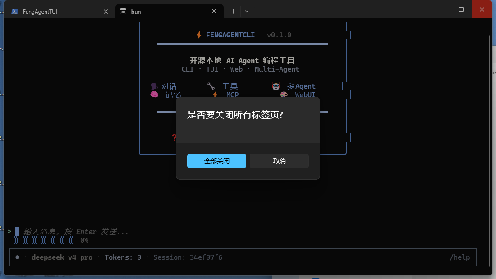
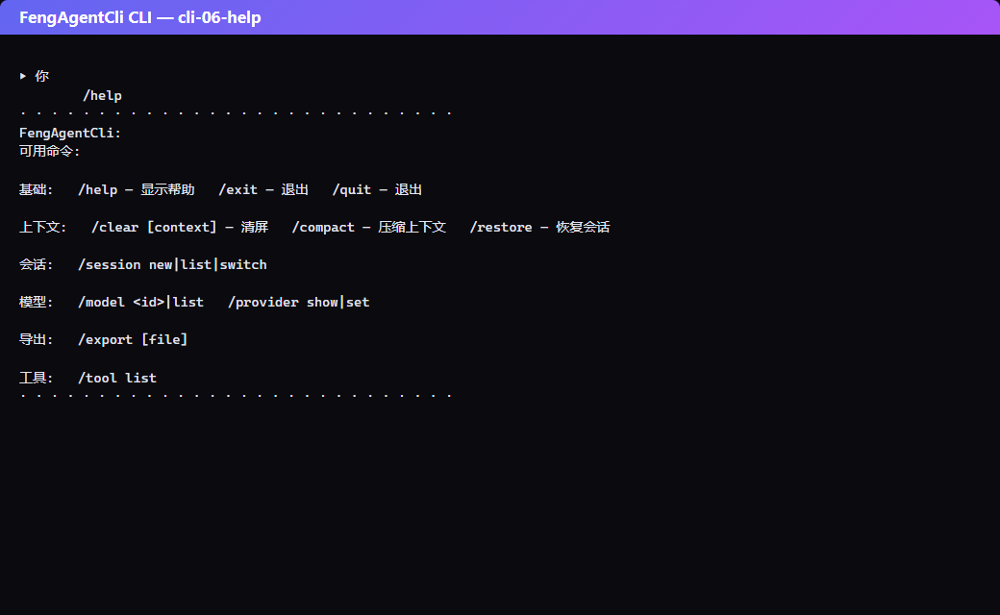
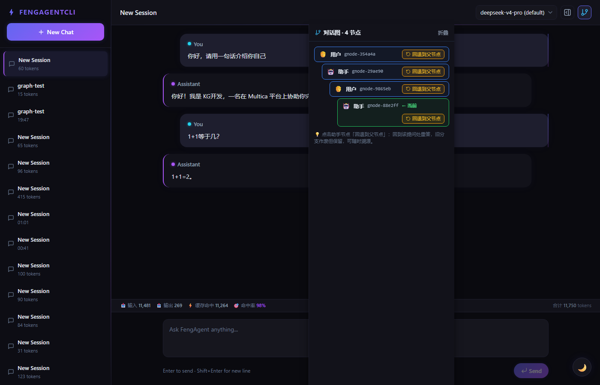
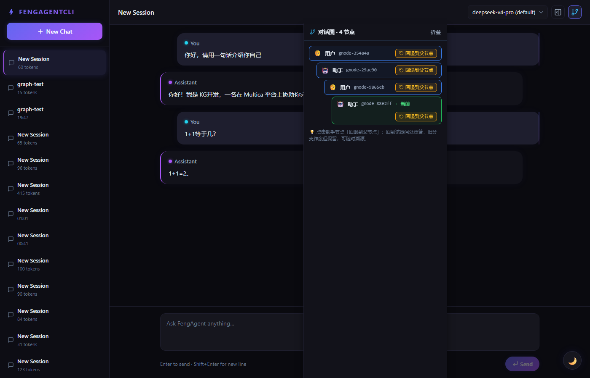
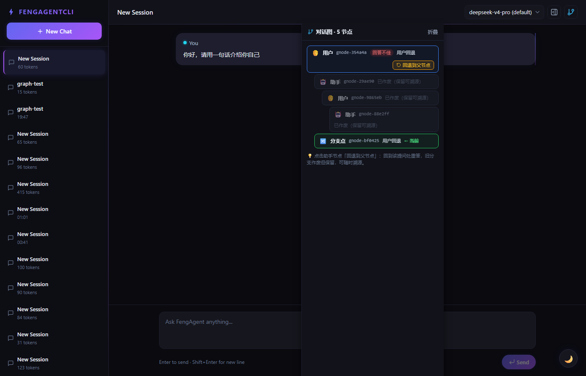
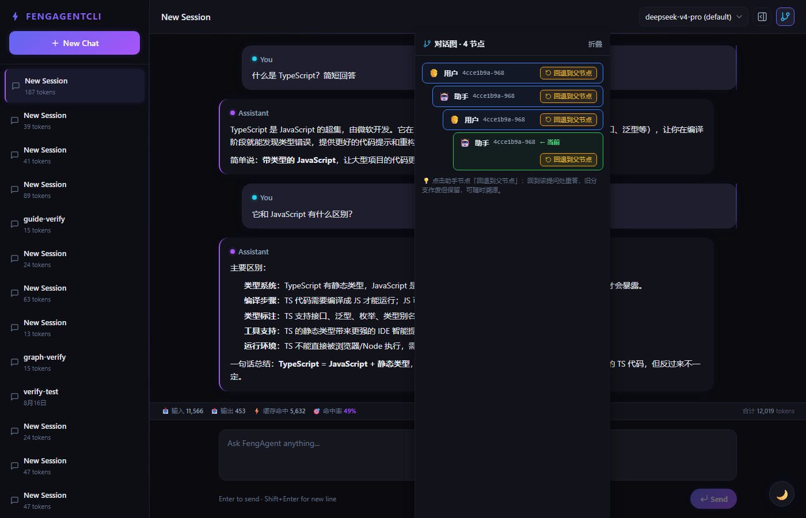

# FengAgentCli 小白保姆级操作手册（refactor/cordis-graph-architecture）

> **本手册适用于 `refactor/cordis-graph-architecture` 分支（HEAD `181726c`，Cordis 插件化 + 对话图/可回溯 + 事件溯源架构）。**
>
> 老分支 `main` 的数据与配置文件与本分支**完全隔离**：main 用 `.fengagent/`，本分支用 `.fengagent-cordis/`，
> 两分支同机运行互不干扰。隔离细节见 [ARCHITECTURE-CORDIS.md §6](./ARCHITECTURE-CORDIS.md)。
>
> 手册目标：**照着复制命令就能跑通**。每个功能都给「能照抄的命令 + 预期输出」。

---

## 目录

1. [名词速览](#1-名词速览)
2. [环境准备（安装 Bun）](#2-环境准备安装-bun)
3. [拉取代码并切换到新分支](#3-拉取代码并切换到新分支)
4. [安装依赖](#4-安装依赖)
5. [配置模型（环境变量 / /provider 命令）](#5-配置模型环境变量--provider-命令)
6. [启动 CLI 开始对话](#6-启动-cli-开始对话)
7. [斜杠命令速查表](#7-斜杠命令速查表)
8. [/ 联想（命令补全）](#8--联想命令补全)
9. [对话图：/graph](#9-对话图graph)
10. [回退重答：/rollback](#10-回退重答rollback)
11. [WebUI 网页对话](#11-webui-网页对话)
12. [Token 与 KV Cache 统计](#12-token-与-kv-cache-统计)
13. [测评模块 bun run eval](#13-测评模块-bun-run-eval)
14. [事件溯源（导出 / 导入 / 重建 / 跨数据根迁移）](#14-事件溯源导出--导入--重建--跨数据根迁移)
15. [分支隔离（main 与 cordis 数据互不干扰）](#15-分支隔离main-与-cordis-数据互不干扰)
16. [常见问题 FAQ](#16-常见问题-faq)
17. [相关文档](#17-相关文档)

---

## 1. 名词速览

| 名词 | 含义 |
|---|---|
| **数据根** | 本分支所有运行时数据（会话、事件日志、图、日志、记忆、配置）的落盘目录，默认 `<项目根>/.fengagent-cordis/` |
| **事件日志** | 会话事实的唯一来源：`<数据根>/events/{sessionId}.jsonl`，append-only，一行一条事件（带 seq + hash 链） |
| **读模型** | 从事件日志投影出来的可读数据：SQLite `sessions.db`（会话/消息）、`graph.jsonl`（对话图派生视图） |
| **投影（Projection）** | 把事件日志"重放"成会话消息 / 对话图节点的过程 |
| **对话图** | 每次「用户提问 → 助手回答」是一个节点，节点连成可溯源、可回退的图 |
| **/rollback 回退** | 觉得某次回答不好，回退到该节点重新回答；旧分支保留（可审计），新回答长出分支 |
| **双写** | 会话事实同时写入「旧存储（SQLite）」和「事件日志」，事件日志为准 |

---

## 2. 环境准备（安装 Bun）

FengAgentCli 用 [Bun](https://bun.sh/) 运行，要求 **Bun >= 1.3.0**。

**Windows（PowerShell）：**

```powershell
# 用官方安装脚本安装 Bun（一路回车即可）
powershell -c "irm bun.sh/install.ps1 | iex"

# 验证
bun --version
# 预期输出（版本号 ≥ 1.3）:
# 1.3.14
```

**macOS / Linux：**

```bash
curl -fsSL https://bun.sh/install | bash
bun --version
```

> 旧版本升级：`bun upgrade`。

---

## 3. 拉取代码并切换到新分支

```bash
git clone https://github.com/zhu011/FengAgentCli.git
cd FengAgentCli
git checkout refactor/cordis-graph-architecture
git log --oneline -1
# 预期输出（commit 会随开发更新，分支 HEAD 即最新）:
# db18dd8 docs(cordis): 小白保姆级操作手册(GUIDE-CORDIS) + 事件溯源迁移CLI + 在线文档站同步
```

> 提示：不切分支直接用 `main` 也可以跑，但**本手册讲的新功能（对话图/回退/事件溯源）只在 cordis 分支有**。

---

## 3.5 全局安装（可选，安装后任意目录直接 `fengagent`）

不想每次 `bun run` 源码的话，可以全局安装：

```bash
# 方式一：npm 全局安装（需要已发布 npm 包或本地打包产物）
bun run pack                       # 项目根目录：编译当前平台二进制 + 打出 fengagent-0.1.0.tgz
npm install -g ./fengagent-0.1.0.tgz

# 方式二：bun link（本地开发，链接到本仓库）
bun link && bun link fengagent

# 安装后直接使用
fengagent                          # 启动 TUI 交互界面
fengagent --version                # FengAgentCli v0.1.0
```

启动器（`bin/fengagent.js`）优先执行 `dist/` 下当前平台的预编译二进制（无需 Bun/Node），
否则退回 bun 源码直跑。

**注册为 Multica 运行时**（在其他电脑的 Multica 中可被检测到）：

```bash
fengagent runtime install          # 写入 ~/.multica/runtimes/fengagent.json
fengagent runtime uninstall        # 移除注册
```

> 说明：Multica 检测自定义运行时的依据是服务端运行时 Profile（`multica runtime profile`）
> 中登记的 `command-name`（本项目的 profile 名为 `FengAgentCli`，命令 `fengagent`）在
> 目标电脑上可解析；因此**全局安装是让 Multica 找到运行时的关键一步**，本地注册文件
> 只是补充信息。详见 README「注册为 Multica 运行时」一节。

---

## 4. 安装依赖

```bash
bun install
```

预期输出：结尾出现类似 `checked N packages` 或 `done`，没有红色 error。国内网络慢可多试一次，或配置镜像：

```bash
bun install --registry https://registry.npmmirror.com
```

安装完成后自检（可选，2 分钟内出结果）：

```bash
bun run typecheck   # TypeScript 类型检查，无 error 即通过
bun test packages/events packages/graph   # 事件溯源 + 图机制测试，全绿
```

---

## 5. 配置模型（环境变量 / /provider 命令）

两种方式**二选一**即可，推荐方式 B（不用重启、不用改环境变量）。

### 方式 A：环境变量（PowerShell / bash）

以 DeepSeek（OpenAI 兼容）为例：

**PowerShell：**

```powershell
$env:FENG_PROVIDER = "openai-compatible"
$env:OPENAI_COMPATIBLE_API_KEY = "sk-你的key"
$env:OPENAI_COMPATIBLE_BASE_URL = "https://api.deepseek.com"
$env:OPENAI_COMPATIBLE_MODEL = "deepseek-chat"
```

**bash：**

```bash
export FENG_PROVIDER=openai-compatible
export OPENAI_COMPATIBLE_API_KEY=sk-你的key
export OPENAI_COMPATIBLE_BASE_URL=https://api.deepseek.com
export OPENAI_COMPATIBLE_MODEL=deepseek-chat
```

其他厂商对应的变量见 [CONFIGURATION.md](./CONFIGURATION.md)（Anthropic / OpenAI / Google / AWS Bedrock 都有）。

### 方式 B：CLI 里用 `/provider` 命令（推荐，免重启免改环境变量）

先随便起一个 CLI（见第 6 节），在对话界面输入：

```
/provider set openai-compatible --api-key sk-你的key --base-url https://api.deepseek.com --model deepseek-chat
```

预期输出：

```
✅ Provider 已配置: openai-compatible (OpenAI-Compatible)
  apiKey:   sk-13****  (已保存，不回显明文)
  baseUrl:  https://api.deepseek.com
  model:    deepseek-chat
  config:   .fengagent-cordis/config.json  (已持久化，重启后自动加载)
  ✓ 已热加载生效 — 直接发消息即可使用新 Provider
```

要点：

- 不带参数时逐项提示输入：`/provider set openai-compatible`，apiKey 输入时**不回显**（显示 `*`）；
- 配置写入**分支级** `.fengagent-cordis/config.json`（不影响 main 的 `.fengagent/config.json`），重启自动加载；
- 立即生效：配置完直接发消息就走新 Provider，无需重启。

查看当前配置：

```
/provider show
```

预期输出（apiKey 只显示前 4 位）：

```
当前 Provider 配置:
  provider: openai-compatible (OpenAI-Compatible)
  baseUrl:  https://api.deepseek.com
  model:    deepseek-chat
  apiKey:   sk-13****  (来源: 环境变量)

提示: /provider set <type> 可修改配置；apiKey 不回显明文。
```

---

## 6. 启动 CLI 开始对话

在项目根目录执行：

```bash
bun run packages/cli/src/entry.ts
```

预期输出：进入全屏 TUI 界面，顶部出现品牌标题卡片（FengAgentCli v0.1.0），下方是消息区、输入行和状态栏（模型 · tokens · 会话）。



直接输入文字回车即发送，例如：

```
你好，请介绍一下这个项目
```

AI 回答时状态栏会显示动态图标动画；回答完成后消息区出现 Markdown 渲染结果（代码块带语法高亮：关键字/字符串/数字/函数分色）。

**长对话滚动** —— 对话很长时内容超屏，用以下按键翻阅历史：

| 操作 | 效果 |
|------|------|
| `PgUp` / `PgDn` | 向上 / 向下翻一屏（约 80% 视口高） |
| 鼠标滚轮 | 向上 / 向下滚动（每格 3 行） |
| `Home` | 一键回到对话最顶端 |
| `End` | 一键回到最底并恢复「贴底跟随」 |

上翻会自动解除贴底，滚到最底自动恢复跟随最新消息；底部出现
`↓ 还有 N 行 · PgUp/PgDn/滚轮 上翻 · Home 回顶` 提示时说明还有未读内容。

**状态栏 token 进度** —— 底部状态栏的进度条显示当前会话上下文占用：百分比保留 1 位小数
（如 `0.2%`，极小值显示 `<0.1%`），旁边有真实 token 计数（`· 12,345 tok`）。占用 ≥85% 时进度条
转警告色，提示接近压缩阈值。

**非交互（管道）模式** —— 不想进界面，问一句就退出：

```bash
echo "解释这段代码" | bun run packages/cli/src/entry.ts
```

**带参数启动**：

```bash
bun run packages/cli/src/entry.ts --model deepseek-chat            # 指定模型
bun run packages/cli/src/entry.ts --session <会话id>                # 恢复历史会话
bun run packages/cli/src/entry.ts --print "一句话问题"               # 强制非交互
```

> **首次运行会自动做一件事**：把 main 遗留数据（`<项目根>/.fengagent/` 或 `~/.fengagent/` 里的
> `sessions.db` / `graph.jsonl`）**只读、一次性、幂等**地导入到 `.fengagent-cordis/`，然后写
> `import.marker` 标记。之后启动直接跳过。它**绝不写入** main 目录，切回 main 分支数据原样保留。

---

## 7. 斜杠命令速查表

在 CLI 对话界面输入 `/help` 可随时查看：

```
可用命令:

基础:
  /help                    — 显示帮助
  /exit                    — 退出程序
  /quit                    — 退出程序

上下文:
  /clear [context]         — 清屏（/clear context 清空上下文）
  /compact                 — 手动压缩上下文
  /restore                 — 从存储恢复会话历史

会话:
  /session new|list|switch — 会话管理

模型:
  /model <id>|list         — 模型切换
  /provider show|set <type> [--api-key ..] [--base-url ..] [--model ..] — 查看/配置 Provider

导出:
  /export [file]           — 导出会话为 Markdown

工具:
  /tool list               — 工具列表

图:
  /graph                   — 查看对话图（节点/分支/溯源链）
  /rollback [节点id]       — 回退到父节点并重答（旧分支保留）

直接输入文本并按 Enter 发送消息。
输入 / 可查看命令补全列表。
```

逐个说明：

| 命令 | 作用 | 示例 / 预期输出要点 |
|---|---|---|
| `/session new 标题` | 新建会话 | `已新建会话: 标题 (xxxx1234)` |
| `/session list` | 列出会话 | 每行 `id 标题 [模型] 时间 ← 当前` |
| `/session switch <id>` | 切换会话 | `已切换到会话: … 消息数: N` |
| `/model list` | 列出当前 Provider 可用模型 | openai-compatible 会拉取真实 `/models` 目录，当前模型标注 `← 当前` |
| `/model <id>` | 切换模型（持久化+热加载） | 见下 |
| `/compact` | 手动压缩上下文 | 显示压缩摘要结果（内容多时有效） |
| `/clear context` | 清空当前会话上下文 | `已清空当前会话上下文…使用 /restore 恢复` |
| `/clear` | 仅清屏 | 界面刷新，会话保留 |
| `/restore` | 从 SQLite 恢复会话历史 | `已恢复会话历史: N 条消息` |
| `/export 文件名.md` | 导出会话为 Markdown | `已导出 N 条消息到: 文件名.md` |
| `/tool list` | 查看已注册工具 | `已注册工具 (N): bash, file-read, …` |
| `/exit` | 退出 | `再见！` |

`/model` 切换示例（在 CLI 内输入）：

```
/model deepseek-reasoner
```

预期输出：

```
✅ 已切换模型: deepseek-chat → deepseek-reasoner
  config: .fengagent-cordis/config.json  (已持久化，重启后自动加载)
  ✓ 已热加载生效 — 后续对话将使用新模型
```

---

## 8. / 联想（命令补全）

在 CLI 对话界面输入 `/`（或 `/` + 前缀），输入框正上方会弹出**命令补全列表**：

- 按前缀过滤：输入 `/m` 只显示 `/model`、`/model list` 等匹配命令（也按描述匹配）；
- `↑` `↓` 选择，`Tab` 或 `Enter` 补全到输入框，`Esc` 关闭列表；
- 命令多时列表可滚动，顶部/底部有 `↑ 还有 N 个命令` / `↓ 还有 N 个命令` 提示；
- 底部提示行：`↑↓选择 · Tab补全 · Esc关闭 · Enter提交`。



> 注：补全列表来自集中维护的命令元数据表（`packages/cli/src/commands.ts` 的 `COMMANDS`），
> 新命令加进表后自动出现在 `/` 联想里。

---

## 9. 对话图：/graph

每一轮「用户提问 → 助手回答（可含工具调用）」都会沉淀为对话图上的节点，
节点类型：`user`（用户）、`assistant`（助手）、`tool`（工具）、`branch-point`（分支点）。
节点之间用边连接，可完整溯源。

在 CLI 对话界面（至少聊过一轮后）输入：

```
/graph
```

预期输出（节点 id / 消息 id 以实际为准）：

```
对话图节点 (3) — 活跃路径 2 个节点:
  🧑 5fb984ec-3ea  type=user  msg=05f75336 (active)
  🤖 5fb984ec-3ea  type=assistant  msg=a2d20d86 (rolled-back)
  🔀 5fb984ec-3ea  type=branch-point  msg=05f75336 ← head

溯源链 (2): 5fb984ec → 5fb984ec

提示: /rollback <节点id> 回退到该节点的父节点并重答（旧分支保留可溯源）。
```

解读：

- `(active)` = 在活跃路径上；`(rolled-back)` = 已被回退作废（保留但不可变）；`← head` = 当前链尾；
- **溯源链**：从根节点到当前 head 的完整链路，每步都能看到用了什么模型、调了什么工具；
- 图数据落盘在 `<数据根>/graph.jsonl`（派生视图），重启后可恢复。

WebUI 里对应「图面板」（见第 11 节），效果见下图：



---

## 10. 回退重答：/rollback

觉得某次回答不满意？回退到那个节点，让 AI 重新回答。**旧分支作废但保留**（可审计），
新回答从分支点长出（可溯源），会话消息截断到回退点。

在 CLI 对话界面输入：

```
/rollback
```

不带参数时，回退到**活跃路径上最后一个助手回答**（即最近一次 AI 回答），自动重答。
也可以指定节点回退到更早：

```
/graph
# 复制想回退的节点 id（例如 5fb984ec-3ea）
/rollback 5fb984ec-3ea
```

预期输出（自动重答过程）：

```
已回退到节点 5fb984ec-3ea（user），作废旧分支 1 个节点（保留可溯源），会话已截断，正在重答。
```

随后 AI 重新回答；再输 `/graph` 可看到：

- 旧 assistant 节点标记 `(rolled-back)`；
- 新回答从 `branch-point` 长出，标记 `← head`。

> WebUI 中：在图面板点节点的「回退」按钮，或在会话操作里点回退，效果一致。

  

---

## 11. WebUI 网页对话

### 方式一：直接跑服务（推荐小白）

```bash
bun run serve
```

预期输出（日志中出现监听地址）：

```
[server] listening on http://127.0.0.1:3000
```

浏览器打开 **http://127.0.0.1:3000** 即可对话。

> 注意：`bun run serve` 服务的是 `web-ui/dist` 构建产物。首次运行如提示找不到静态文件，
> 先执行 `bun run build:web-ui` 再 `bun run serve`。

### 方式二：开发模式（前后端热更新）

```bash
bun run dev
```

- 后端 Server：http://127.0.0.1:3000
- 前端 Vite：http://localhost:5180（自动代理 /api 到后端，改前端代码即时生效）

### 一键 Demo（自动构建 + 启动 + 打开浏览器）

```bash
# Windows
powershell -ExecutionPolicy Bypass -File scripts/demo.ps1
# Linux/macOS
bash scripts/demo.sh
```

### WebUI 里能做什么

- **对话**：左侧会话列表（新建/切换/删除），中间消息区（Markdown 渲染、流式输出），底部输入框；
- **Token 统计栏**：消息区下方实时显示「📥 输入 / 📤 输出 / ⚡ 缓存命中 / 🎯 命中率 / 合计 tokens」（见第 12 节）；
- **图面板**：对话同时右侧展示对话图（节点树 + 活跃高亮 + 回退按钮 + 作废分支灰显保留），点「回退」即重答并自动刷新会话与图；
- **主题切换**：右上角切换 3 套主题。




---

## 12. Token 与 KV Cache 统计

每次 LLM 调用都会在响应里带回用量：输入 token、输出 token，以及 **KV Cache 读取/创建 token**
（DeepSeek 等厂商会返回 `prompt_cache_hit_tokens` / `prompt_cache_miss_tokens`）。

**WebUI 展示**：消息区下方的统计栏实时累计本会话的用量：

```
📥 输入 573,875    📤 输出 5,904    ⚡ 缓存命中 491,648    🎯 命中率 86%    合计 579,779 tokens
```

- 命中率 = 缓存读取 token / (缓存读取 + 非缓存输入) × 100%；
- 缓存命中多说明长上下文复用得好，**省成本**（缓存读取比新计算便宜很多）；
- 数据来源是 LLM 返回的 `usage` 字段，科学可溯源（WebUI 经 SSE 的 `usage` 事件累计）。

**CLI / 日志**：每次请求的完整 usage 也会写入 `<数据根>/logs/llm-trace-{date}.jsonl`
（LLM Trace 日志），供第 13 节测评模块分析。

---

## 13. 测评模块 bun run eval

测评模块读取 LLM Trace 日志（`<数据根>/logs/llm-trace-{date}.jsonl`），自动分析
**工具调用成功率、任务完成率、错误率、Token 用量、KV Cache 命中率、模型对比**，输出 Markdown 报告。

```bash
# 分析今天的日志
bun run eval

# 分析指定日期
bun run eval --date=2026-08-16

# 分析全部日志
bun run eval --all

# 分析指定文件
bun run eval --file=.fengagent-cordis/logs/llm-trace-2026-08-16.jsonl

# 排除某些模型（如测试 mock 模型）
bun run eval --date=2026-08-16 --exclude-model=test-model,custom-model
```

预期输出（以真实数据为例）：

```
分析日志: D:\...\.fengagent-cordis\logs\llm-trace-2026-08-16.jsonl

============================================================
FengAgentCli Agent 测评报告
============================================================
日志文件: ...\llm-trace-2026-08-16.jsonl
会话数: 5
LLM 调用: 20
总耗时: 89.64s
平均耗时: 4482ms
输入 Token: 573875 (avg 28694)
输出 Token: 5904 (avg 295)
工具调用: 15 (75%)
错误: 0 (0%)

KV Cache:
  读取 Token: 491648
  创建 Token: 82227
  命中率: 86%

工具使用分布:
  bash: 26

完成原因:
  end_turn: 5
  tool_use: 15

报告已保存: D:\...\.fengagent-cordis\logs\eval-report-2026-08-16.md
============================================================
```

报告同时保存为 Markdown：`<数据根>/logs/eval-report-{date}.md`，包含
**模型准确率对比表**（每个模型的总调用、工具成功率、任务完成率、错误率、平均耗时、平均输入/输出、Cache 读取与命中率），
可用于不同模型/不同提示词版本的横向对比，优化工具描述与系统提示词。

---

## 14. 事件溯源（导出 / 导入 / 重建 / 跨数据根迁移）

### 14.1 事件日志在哪

每个会话一个 append-only 事件文件：

```
<项目根>/.fengagent-cordis/events/{sessionId}.jsonl
```

- 一行一条事件（`session/created`、`user/message`、`step/start`、`assistant/chunk`、`rollback`…）；
- 每条事件带信封：`seq`（递增）+ `hash`/`prevHash`（sha-256 链）→ **篡改可检出**；
- 崩溃残留的尾部半行会自动自愈跳过，不丢已落盘事件。

### 14.2 命令行工具

仓库内置事件溯源迁移 CLI（`scripts/events-migrate.ts`），在项目根目录执行：

```bash
# 查看用法
bun run scripts/events-migrate.ts --help

# 列出有事件日志的会话
bun run scripts/events-migrate.ts list

# 校验事件链 + 双写对账（事件投影 === SQLite 读模型）
bun run scripts/events-migrate.ts verify

# 整库导出事件 → 可移植文件（每会话一个 .fengevents.jsonl）
bun run scripts/events-migrate.ts export --dir ./events-export

# 导出单个会话
bun run scripts/events-migrate.ts export --session <会话id> --dir ./events-export

# 导入可移植事件文件（幂等去重，只写事件日志）
bun run scripts/events-migrate.ts import ./events-export

# 以事件为准重建读模型（SQLite；--prune 清理事件日志中不存在的孤儿会话）
bun run scripts/events-migrate.ts rebuild
bun run scripts/events-migrate.ts rebuild --prune
```

### 14.3 预期输出（真实运行示例）

`list`：

```
数据根: D:\...\.fengagent-cordis

事件日志会话 (5):
  5fb984ec-3ea5-4242-9414-ae5a125baa38  (10 条事件, seq 1→10)
  ...
```

`verify`（事件链 + 双写对账全绿）：

```
数据根: D:\...\.fengagent-cordis

① 事件链校验（seq 连续 + hash/prevHash 链）:
    ✓ 5fb984ec-...: 10 条事件，链完整
    ✓ ...

② 双写对账（事件投影 === SQLite 读模型）:
    参与对账: 5 个会话
    ✓ 全部一致（投影 === 读模型）
```

`export --dir ./events-export`：

```
数据根: D:\...\.fengagent-cordis

已导出 5 个会话的事件到: D:\...\events-export
  D:\...\events-export\5fb984ec-....fengevents.jsonl
  ...

提示: 这些 .fengevents.jsonl 是机器无关的可移植文件，
可复制到另一台机器 / 另一数据根，用 import 子命令导入。
```

`import`（对同一数据根重复导入 = 幂等跳过；对全新数据根 = 全部导入）：

```
导入结果 (...\events-export):
  成功导入: 0 个会话      # 全新根会显示 5
  幂等跳过: 5 个会话      # 已包含 → noop
  失败拒绝: 0 个会话
```

`rebuild`：

```
以事件为准重建读模型（SQLite）:
  成功重建: 5 个会话
  无事件跳过: 0 个会话

提示: 重建只读事件日志 + 写读模型，绝不追加事件（事件文件字节级不变）。
```

### 14.4 跨数据根 / 跨机迁移（完整演练）

场景：把 A 机器的会话完整搬到 B 机器（或从 `.fengagent` 迁移到新数据根）。

**第 1 步 — 在源数据根导出：**

```bash
bun run scripts/events-migrate.ts export --dir ./events-export
```

**第 2 步 — 把 `events-export/` 整个文件夹拷到目标机器**（U 盘 / scp / git 均可，文件是机器无关的）。

**第 3 步 — 在目标机器（新数据根）导入 + 重建 + 校验：**

```bash
# 目标机器项目根下，指定一个全新的数据根（默认 .fengagent-cordis 也行）
$env:FENG_DATA_DIR = "D:\path\to\new-data-root"      # PowerShell
# export FENG_DATA_DIR=/path/to/new-data-root        # bash

bun run scripts/events-migrate.ts import ./events-export
bun run scripts/events-migrate.ts rebuild
bun run scripts/events-migrate.ts verify
```

预期输出：`成功导入: 5` → `成功重建: 5` → `✓ 全部一致`。

**第 4 步 — 新根继续对话**：在 `FENG_DATA_DIR` 指向新根的情况下正常启动 CLI/WebUI，
新对话的事件会从迁移后的 seq 继续追加（无缝续接），迁移完成。

> 迁移语义保证：导入校验五连（header → 事件行 → 计数/链尾 hash → #5 hash 链 → 注册表+幂等去重），
> 任何一步失败即拒绝且目标日志不动；重建只读事件日志、绝不追加事件。

---

## 15. 分支隔离（main 与 cordis 数据互不干扰）

### 15.1 数据根对照

| 数据 | main 分支 | cordis 分支（本分支） |
|---|---|---|
| 会话库 | `.fengagent/sessions.db` | `.fengagent-cordis/sessions.db` |
| 对话图 | `.fengagent/graph.jsonl` | `.fengagent-cordis/graph.jsonl` |
| 事件日志 | 无 | `.fengagent-cordis/events/*.jsonl` |
| 日志 / llm-trace | `.fengagent/logs/` | `.fengagent-cordis/logs/` |
| 记忆 | `.fengagent/memory/` | `.fengagent-cordis/memory/` |
| 配置（/model /provider 写入） | `.fengagent/config.json` | `.fengagent-cordis/config.json` |
| agents/skills/plugins 定义 | `.fengagent/agents/` 等 | 只读共享 main 的定义 |

### 15.2 数据根解析优先级

```
FENG_DATA_DIR（环境变量，最高）
  → 配置文件里的 dataDir
  → 默认 <项目根>/.fengagent-cordis
```

### 15.3 首次运行自动导入（单向、幂等、只读）

- 触发条件：数据根内 `events/` 为空 且 `sessions.db` 不存在；
- 导入源探测：`FENG_MAIN_DATA_DIR` → `<项目根>/.fengagent` → `~/.fengagent` → `<项目根>/data`，
  取第一个含 `sessions.db`/`graph.jsonl` 的目录；
- 导入后写 `import.marker`（来源根+时间+文件数），后续启动跳过；
- **只读 main、绝不写回**；`FENG_DATA_DIR` 若显式指向 main 数据根则触发自环防护，跳过导入。

### 15.4 切回 main 分支

```bash
git checkout main
```

main 的 `.fengagent/` 目录从未被动过，数据原样。想彻底清掉 cordis 数据就删目录：

```bash
# 删除新分支数据根（会话/事件/图/日志全没了，操作前确认）
Remove-Item -Recurse -Force .fengagent-cordis    # PowerShell
rm -rf .fengagent-cordis                          # bash
```

> 两分支的代码改动相互独立（新包 `packages/cordis`、`packages/graph`、`packages/events`
> 与 main 零交集；对既有文件的改动均为向后兼容增量），`main` 检出即用。

---

## 16. 常见问题 FAQ

**Q1：`bun run packages/cli/src/entry.ts` 报 `Failed to initialize agent: ... API_KEY`？**
没配模型。按第 5 节方式 A 设置环境变量，或方式 B 在 CLI 里 `/provider set`。
若 `createAgent is not defined` 之类的报错：`bun install` 没成功或依赖版本不匹配，重跑安装。

**Q2：对话没有反应 / 一直转圈？**
先看 `<数据根>/logs/fengagent-{date}.log` 和 `llm-trace-{date}.jsonl` 有没有新记录；
多半是 API Key / Base URL 配置问题（`/provider show` 检查），或网络不通。

**Q3：/graph 显示「当前会话还没有图节点」？**
先至少对话一轮。节点在每次「用户提问 → 助手回答」后生成。

**Q4：回退后旧内容去哪了？**
旧分支节点标记 `rolled-back` 保留在事件日志与 graph 视图里（可审计），读模型消息截断到回退点。
可用事件导出（第 14 节）把历史完整导走。

**Q5：main 分支的会话/记忆会不会被 cordis 分支弄乱？**
不会。cordis 分支只读 main 数据做一次导入，写入全在 `.fengagent-cordis/`。

**Q6：如何恢复被 `/clear context` 清空的会话？**
`/clear context` 只清内存上下文（消息历史），会话 ID 保留；输入 `/restore` 从 SQLite 恢复历史。
WebUI 端切换会话即可重新加载。

**Q7：`bun run serve` 打开页面空白？**
先 `bun run build:web-ui` 构建前端产物再启动；或直接用 `bun run dev`。

---

## 17. 相关文档

| 文档 | 内容 |
|---|---|
| [在线文档站](https://zhu011.github.io/FengAgentCli/) | 交互式文档（暗色主题，展示本分支状态） |
| [ARCHITECTURE-CORDIS.md](./ARCHITECTURE-CORDIS.md) | Cordis 插件化 + 对话图/事件溯源架构设计（§6 分支隔离、§7 事件溯源） |
| [ARCHITECTURE.md](./ARCHITECTURE.md) | main 老架构 |
| [CONFIGURATION.md](./CONFIGURATION.md) | 环境变量、配置文件、权限规则 |
| [DEVELOPMENT.md](./DEVELOPMENT.md) | 本地开发、测试、构建 |
| [EXTENDING.md](./EXTENDING.md) | 添加 Provider / 工具 / 插件 / Agent |
| [MODULES.md](./MODULES.md) | 各包 API 接口 |
